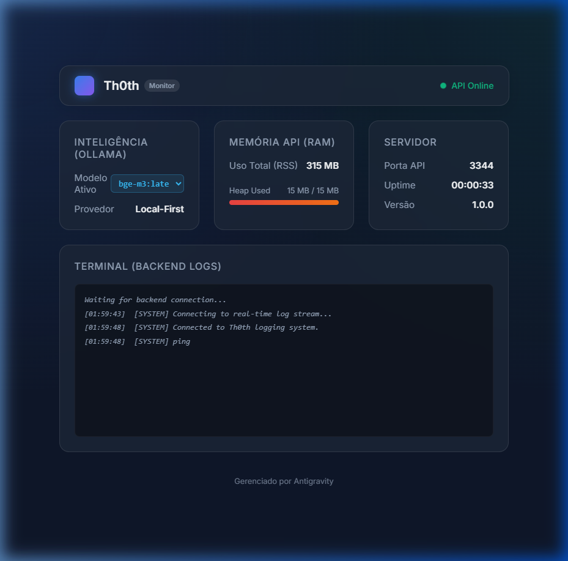

# seshat API Dashboard and Automation Guide

## Objetivos Alcançados

O principal objetivo desta implementação foi automatizar a inicialização da API seshat em background no Windows e providenciar uma interface gráfica (Monitor) para acompanhamento do uso de hardware, status do servidor, logs da API em tempo real e a troca dinâmica de modelos de IA locales.

Tudo isso foi concluído com sucesso e implementado no pacote principal do seshat.

## Mudanças Realizadas

### 1. Automação de Inicialização e Desligamento
*   **`start-api.bat`**: Script que inicializa o Ollama em segundo plano e executa o backend do seshat na porta **3344**.
*   **`stop-api.bat`**: Script de limpeza que encerra os processos da API, Ollama e fecha a janela do Dashboard.

### 2. Painel de Monitoramento (Frontend)
Localizado em `dashboard/`, o painel oferece:
*   Visualização de status (Online/Offline).
*   Métricas de hardware (RAM/CPU/Uptime).
*   Troca dinâmica de modelos do Ollama.
*   Streaming de logs via SSE (Server-Sent Events).

### 3. Modificações na API seshat (Backend)
*   Porta padrão alterada para **3344**.
*   Novas rotas de sistema para métricas e troca de modelos.
*   Sistema de captura de logs nativo integrado às rotas da API.

### 4. Integração MCP (Antigravity)
As ferramentas de busca semântica foram validadas e agora utilizam o endereço `127.0.0.1:3344` para máxima compatibilidade no Windows. No `mcp_config.json`, certifique-se de que a `SESHAT_API_URL` aponta para este endereço.

---

## Verificação de Funcionamento

O Dashboard permite monitorar a saúde do sistema e visualizar os logs conforme as operações de busca ocorrem.

### Busca Semântica
A ferramenta `seshat_search` via MCP foi validada retornando resultados precisos após a indexação do projeto, confirmando que a pipeline completa (Ollama -> Embeddings -> API -> MCP) está funcional.

---

## Como Operar via Antigravity

Foram criados workflows que permitem controlar a infraestrutura diretamente pelo chat:
*   Digite `/seshat-start` para ligar os motores.
*   Digite `/seshat-stop` para encerrar os serviços e liberar memória.

---

## Notas Técnicas (Troubleshooting)

Se notar travamentos ao rodar comandos de `build` ou `dev` no terminal do Bun, verifique se o servidor MCP do seshat está ativo. Em ambientes Windows, o processo do MCP pode ocasionalmente causar bloqueios em sessões interativas de console. Desativar momentaneamente o plugin resolve o impasse.
